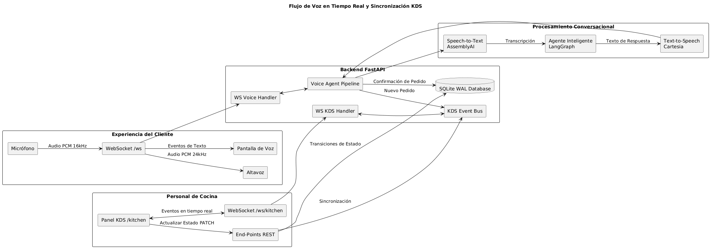

# Voice Sandwich Shop & Kitchen Display System (KDS) 🥪

Este proyecto es un demostrador de última generación que implementa un flujo conversacional de voz a voz en tiempo real combinado con un completo **Kitchen Display System (KDS)** para la cocina de un restaurante de sándwiches. 

El sistema permite a los clientes realizar pedidos conversando de forma natural con un agente de inteligencia artificial (que entiende el menú, gestiona su carrito y procesa la compra), y simultáneamente permite al personal de cocina recibir, preparar y despachar los pedidos en tiempo real en una interfaz tipo Kanban reactiva, sin necesidad de recargar la página.

---

## Arquitectura del Sistema

El flujo de voz en tiempo real y la sincronización del KDS se conectan de la siguiente manera:



---

##  Características Principales

### 1. Asistente de Voz del Cliente (`/`)
* **Voz a Voz de Baja Latencia:** Conversación fluida y bidireccional por WebSockets utilizando el micrófono del navegador.
* ** Speech-to-Text (STT):** Transcripción en tiempo real gracias a la API streaming de **AssemblyAI**.
* **Agente Inteligente:** Implementado con **LangGraph** y **LangChain** para mantener el estado de la sesión, consultar el menú dinámicamente, gestionar el stock, agregar ingredientes al carrito y procesar la confirmación.
* **Text-to-Speech (TTS):** Respuestas de voz hiperrealistas a través de **Cartesia**.
* **Limpieza de Sintaxis de Voz:** Oculta dinámicamente etiquetas de control de síntesis de voz (como `<spell>`) del texto en pantalla para ofrecer una interfaz limpia, garantizando que el audio siga pronunciando de manera óptima las letras individuales de los códigos.

### 2. Kitchen Display System (KDS) (`/kitchen` o `/#/kitchen`)
* **Tablero Kanban Reactivo:** Dividido en tres columnas principales: **Nuevos**, **En Preparación** y **Listos**.
* **Sincronización en Tiempo Real:** Los pedidos aparecen al instante de ser confirmados por voz mediante WebSockets dedicados (`/ws/kitchen`) y suscripciones concurrentes seguras.
* **Interacciones Fluídas:** Botones interactivos para avanzar el estado de los pedidos con transiciones dinámicas que notifican de inmediato a todas las pantallas abiertas.
* **Diseño Premium Claro (Light Theme):** Estética moderna, limpia y minimalista adaptada en color claro tanto para el panel del cliente como para el KDS de cocina, con sombras tridimensionales y micro-animaciones vibrantes.
* **Optimización de Pantalla (748 x 698):** Diseño horizontal multi-columna responsivo (`sm:grid-cols-3`) que se adapta a las dimensiones requeridas, manteniendo las tarjetas compactas sin espacios vacíos.
* **Robustez Extrema:** Controladores tolerantes a fallos en el frontend que evitan pantallas en blanco si algún pedido antiguo o de pruebas carece de campos obligatorios como fecha de creación o líneas de pedido.

### 3. Base de Datos SQLite (Modo WAL)
* Persistencia transaccional de productos, stock disponible, carritos de sesión independientes y pedidos activos.
* Configuración en **modo WAL (Write-Ahead Logging)** que garantiza lecturas y escrituras seguras y concurrentes entre los diferentes hilos del agente y la API REST.

---

## Variables de Entorno (Requisito Obligatorio)

Para que el backend de Python pueda comunicarse con los servicios de inteligencia artificial y síntesis, debes configurar las siguientes variables de entorno. Puedes crear un archivo llamado `.env` en la raíz de `components/python/` con este formato:

```env
OPENAI_API_KEY=tu_api_key_de_openai
ASSEMBLYAI_API_KEY=tu_api_key_de_assemblyai
CARTESIA_API_KEY=tu_api_key_de_cartesia
```

---

## Guía de Arranque (Paso a Paso)

Este proyecto está dividido en componentes desacoplados: el frontend en `components/web` (Svelte 5) y el backend de Python en `components/python` (FastAPI). Sigue estos pasos para levantarlo de forma manual en tu máquina.

### Paso 1: Configurar y Compilar el Frontend (`components/web`)

La carpeta `web` contiene el código fuente de la interfaz gráfica. Debe compilarse para que el servidor backend de Python pueda servir los archivos de manera estática.

1. Abre tu terminal y navega al directorio del frontend:
   ```powershell
   cd components/web
   ```
2. Instala las dependencias necesarias de Node utilizando `pnpm`:
   ```powershell
   pnpm install
   ```
3. Compila los archivos del frontend para producción:
   ```powershell
   pnpm build
   ```
   *(Opcional: Si vas a modificar el frontend y quieres ver los cambios en tiempo real, puedes correr `pnpm build --watch` para que auto-compile al guardar).*

### Paso 2: Configurar y Levantar el Backend de Python (`components/python`)

La carpeta `python` aloja el servidor FastAPI, el agente de IA, las bases de datos y la orquestación WebSocket del KDS.

1. Abre una nueva ventana de terminal y navega al directorio de Python:
   ```powershell
   cd components/python
   ```
2. Sincroniza y descarga las dependencias de Python utilizando el gestor de paquetes de alto rendimiento `uv`:
   ```powershell
   uv sync --dev
   ```
3. Ejecuta el archivo principal para iniciar el servidor uvicorn:
   ```powershell
   uv run src/main.py
   ```

El servidor se levantará en el puerto `8000`.

---

## ¿Cómo Usar el Sistema?

Una vez levantado todo con éxito:

1. **Pantalla del Cliente (Pedido por Voz):**
   Entra en tu navegador a: **[http://localhost:8000/](http://localhost:8000/)**
   * Presiona el botón del micrófono central y di: *"Hola, me gustaría un pan ciabatta con pollo y queso cheddar"*.
   * Observa el carrito flotante actualizándose dinámicamente.
   * Confirma tu pedido diciendo: *"Sí, confirmo el pedido"*.
   * Recibirás un código corto de 4 caracteres (ej: `089F`).

2. **Pantalla de Cocina (KDS Kanban):**
   Entra en otra pestaña o pantalla a: **[http://localhost:8000/kitchen](http://localhost:8000/kitchen)** (o alternativamente **[http://localhost:8000/#/kitchen](http://localhost:8000/#/kitchen)**)
   * Verás instantáneamente tu pedido en la columna **Nuevos** con una alerta animada en tiempo real.
   * Pulsa **"Comenzar preparación"** para moverlo a **En Preparación**.
   * Pulsa **"Marcar como listo"** para moverlo a **Listos** una vez que esté terminado.